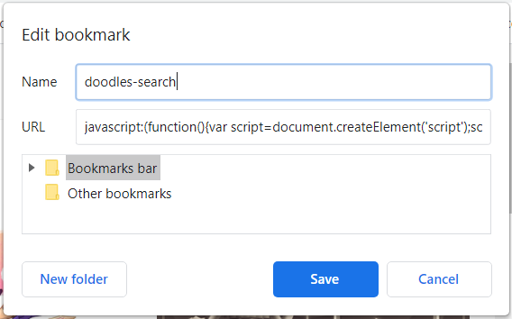

# browser-bookmarks
This is repository with examples of JS implementation of bookmarks for web forms fast filling 

To use just copy this script to your browser bookmarklet

Google doodles search bookmarklet :

> ``javascript:(function(){var script=document.createElement('script');script.type='text/javascript';script.src='https://alexkazarin.github.io/browser-bookmarks/examples/google-doodles.js';document.body.appendChild(script);})()``

Ex.:

For faster use of javascript bookmarks you could use Chrome extension 'Speed Dial' and run your scripts with hotkeys (Alt+1,Alt+2...) 
